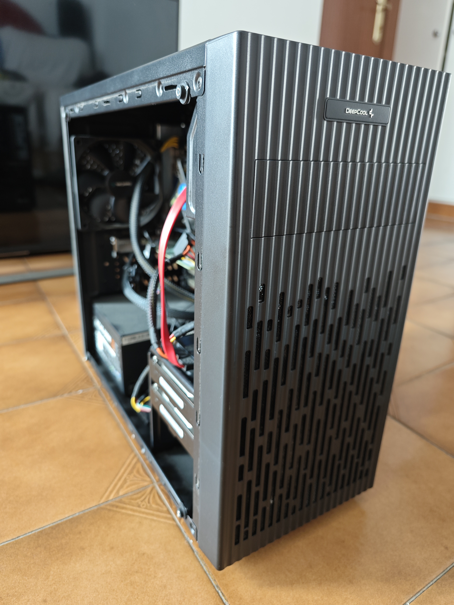
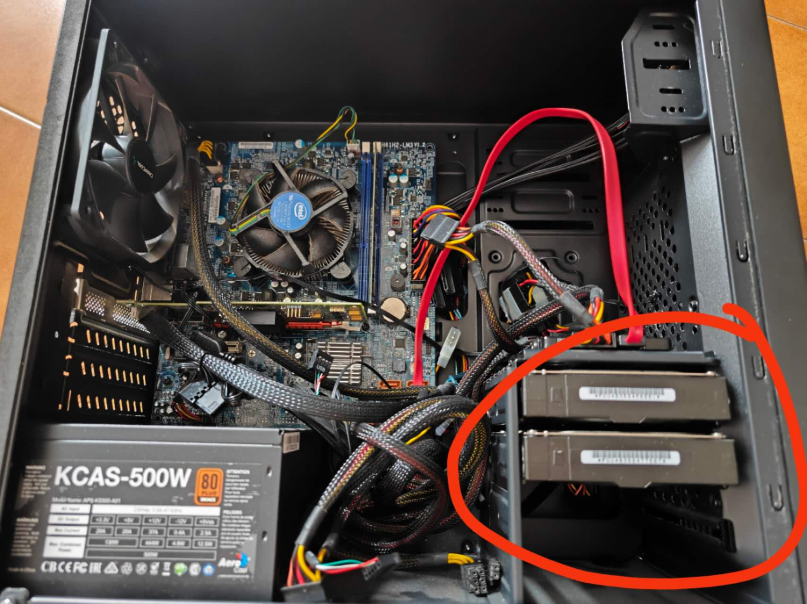
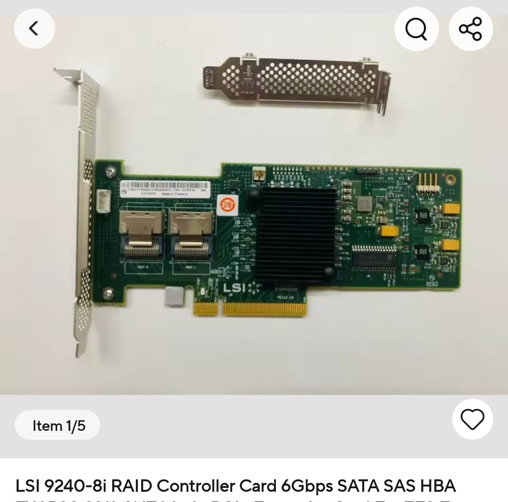
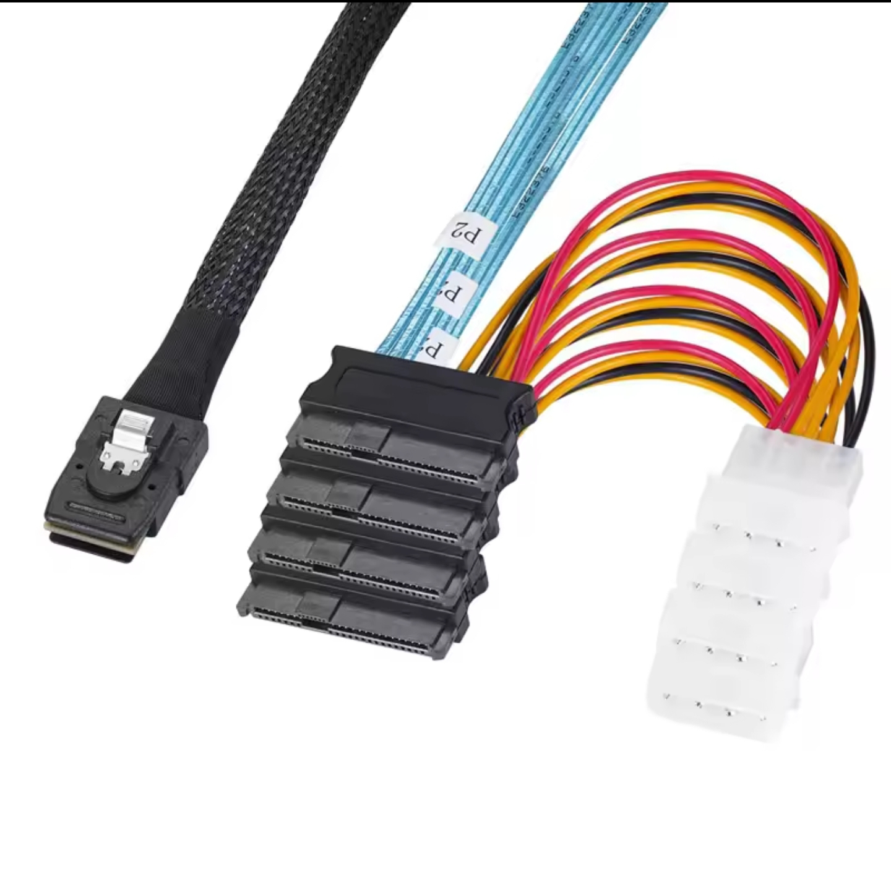

# TrueNASS Homebuild: Budget NAS with SAS Enterprise Drives + LSI IT Mode HBA

## 🎯 Project Goal

This repository documents how to build a high-capacity, budget-friendly home NAS using SAS enterprise drives and an LSI HBA card flashed to IT mode.  
It's aimed at enthusiasts who want to repurpose cheap SAS disks and achieve maximum flexibility at low cost.

## ⚠️ Minimum hardware requirements

- A spare old PC with:
  - At least one gigabit Ethernet port (onboard or PCIe)
  - One free PCIe slot for the HBA card
  - A small SSD or spare HDD for the TrueNAS system drive (a USB stick works for testing, but not recommended for production)
---

## 💡 Why this build?

- ✅ **Low cost:** SAS enterprise drives are often cheap in second-hand markets (eBay, AliExpress, local resellers).
- ✅ **High scalability:** An LSI 9240-8i HBA in IT mode supports up to 8 disks (and more with expanders).
- ✅ **TrueNAS / ZFS friendly:** No hardware RAID interference; full control at the OS level.
- ✅ **Flexible upgrade path:** Add more disks or switch hardware easily.

## Example Build Overview

If you have a spare old PC and some SAS enterprise drives and are wondering how to integrate them into your NAS system, this is one sample solution for you.

First, make sure your case has at least one fan mount to provide cooling for your drives. In this build, I installed 2 SAS disks in the mounting frame, along with a fan to provide airflow over the drives. There is also enough space in the case for proper air intake to keep temperatures low.

## HBA Card and Cabling

To incorporate SAS drives into the system, I chose the **LSI 9240-8i controller card**.  
Make sure the card is flashed to **IT mode** so that TrueNAS (or other OS) can directly control the disks without hardware RAID interference.  
You can find these cards on AliExpress or eBay at very low prices.

For cabling, I used a **Mini SAS (SFF-8087) to 4 x SAS 29-pin + Molex power** cable.  
Normally, each Mini SAS connector can handle up to 4 disks.  
Since this card has two Mini SAS ports, it supports up to 8 disks in total.  

In my case, I only installed 2 SAS disks, so a single Mini SAS cable is enough.  

⚠ **Important tip:**  
When choosing cables, make sure the connector heads will fit your case.  
These headers can be quite tall, and in many compact cases, clearance may be an issue.  
I chose cables with Molex power connectors because the SATA-powered versions were too tall to fit comfortably in my chassis.

## Why IT Mode Matters

When using an LSI HBA (Host Bus Adapter) card, the firmware mode determines how the disks are managed by the system.  
There are two common modes:

- **IR mode (Integrated RAID)**  
  The HBA handles the disks as hardware RAID devices. The OS sees the RAID arrays, not individual disks.  
  This means the HBA creates and manages RAID volumes, and the OS (such as TrueNAS) has no direct control over each disk.  

- **IT mode (Initiator Target / passthrough)**  
  The HBA simply passes through the physical disks directly to the OS.  
  This allows software like TrueNAS / ZFS to fully manage the disks, monitor SMART data, and create its own storage pools (e.g. ZFS pools).  

⚠ **Key point:**  
Only in IT mode can the disks (including SAS enterprise drives) be connected to your system in a way that software like TrueNAS can use them properly.  
Without IT mode, the HBA will try to manage the disks as hardware RAID, which is not compatible with ZFS best practices and reduces flexibility.
